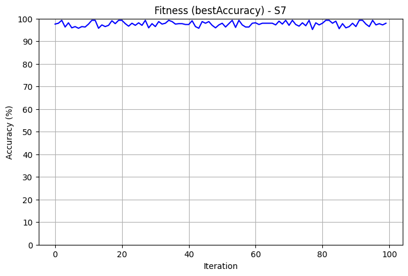
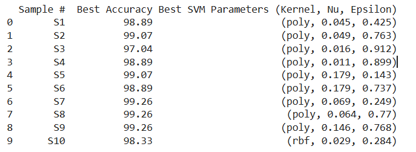

# 🧠🔍 SVM Optimization on UCI Digits Dataset

This project performs hyperparameter optimization of a Support Vector Machine (SVM) classifier on the UCI Optical Recognition of Handwritten Digits dataset. The goal is to evaluate the performance of an SVM classifier using multiple train-test samples and track the convergence of accuracy over 100 randomized optimization iterations.

---

## 👨‍💻 Author
**Navneet Sagar**  
**Roll Number:** 102203715

---

## 📊 Dataset

We use the `load_digits` dataset from Scikit-learn (UCI-origin), which contains:

- 1797 samples of 8x8 pixel handwritten digits (0 to 9)  
- 64 features (flattened pixel intensities)  
- 10 classes (digits 0 to 9)  

---

## 🛠️ Methodology

1. The dataset is randomly split **10 times** into **70% training** and **30% testing** sets.
2. For each split:
   - The data is standardized using `StandardScaler`.
   - **100 iterations** of randomized SVM hyperparameter optimization are run.
   - The best accuracy and corresponding hyperparameters are recorded.

### 🔧 SVM Classifier Used

- `sklearn.svm.NuSVC`

### 🧪 Hyperparameters Randomized

- `kernel`: `'linear'`, `'rbf'`, `'poly'`
- `nu`: float ∈ [0.01, 0.4]
- `epsilon`: float ∈ [0.01, 1] *(only recorded, not used in NuSVC)*

---

## 📈 Outputs

- `svm_optimization_results.csv`: Accuracy and best parameters for each sample.
- `accuracy.png`: Plot showing accuracy vs iteration for the best-performing sample.
- `stats.png`: Summary plot comparing accuracy across 10 samples.
- Console output of all 10 sample results.

### 📷 Visualizations

#### Accuracy Convergence Plot

#### Sample Statistics Plot

---

